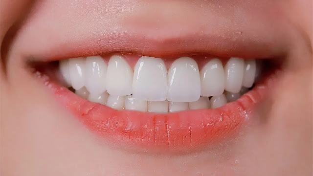
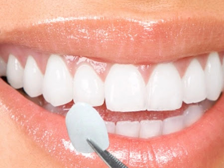
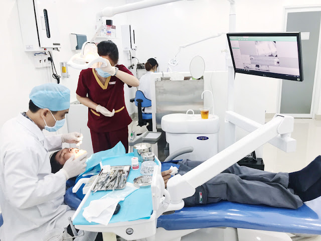

## Dán răng sứ Veneer ở đâu tốt tại TPHCM?
Meta des: Tân trang và chăm sóc cho nụ cười trắng sáng, tươi đẹp, đủ tự tin để mang lại vẻ bề ngoài tự tin bằng phương pháp dán răng sứ Veneer đang được nhiều người lựa chọn hãy liên hệ số điện thoại 0963234148 để được tư vấn cụ thể nhất.
---
title: "Dán răng sứ Veneer ở TPHCM — Nha khoa Asia"
description: "Dán răng sứ Veneer tại Nha khoa Asia (TPHCM): quy trình chuẩn, bác sĩ chuyên môn, công nghệ CAD/CAM và bảo hành. Liên hệ 0963234148 để được tư vấn."
keywords: ["dán răng sứ","Veneer","TPHCM","sac dep nha khoa","Nha khoa Asia"]
---

# Dán răng sứ Veneer ở đâu tốt tại TP.HCM — Nha khoa Asia

Tân trang nụ cười bằng dán răng sứ Veneer là lựa chọn an toàn và thẩm mỹ cho những ai muốn có một hàm răng đều, trắng và tự nhiên. Tại Nha khoa Asia (TP.HCM), với hơn 10 năm kinh nghiệm, đội ngũ bác sĩ tay nghề cao và công nghệ hiện đại đảm bảo kết quả ổn định, bền đẹp. Nếu bạn quan tâm tới dịch vụ, gọi ngay 0963234148 để được tư vấn cụ thể.

## Khi nào nên dán răng sứ Veneer

Dán Veneer phù hợp với các trường hợp: răng nhiễm màu nặng không thể tẩy trắng, răng bị mẻ/ vỡ nhỏ, răng sắp đều muốn cải thiện hình thể, hoặc muốn thay đổi màu sắc/ hình dạng răng mà vẫn giữ răng thật tối đa. Veneer là lớp sứ mỏng (khoảng 0.2–0.5 mm) được dán lên bề mặt răng, mang lại nụ cười tự nhiên.

## Quy trình tiêu chuẩn tại Nha khoa Asia

1. Khám tổng quát & chụp X-quang để đánh giá cấu trúc răng và xác định phương án điều trị.
2. Lên thiết kế nụ cười (mock-up) giúp bạn hình dung kết quả trước khi điều trị.
3. Lấy dấu hàm và chế tạo Veneer tạm để thử nghiệm màu và dáng răng.
4. Dũa men răng tinh tế (nếu cần) và gắn Veneer tạm.
5. Gắn Veneer thật, hiệu chỉnh màu và khớp cắn — có thể làm 2 lần đến khi hài lòng.

## Tiêu chí chọn nha khoa dán Veneer uy tín

- Trình độ bác sĩ: Kinh nghiệm chuyên sâu về thẩm mỹ, con mắt thẩm mỹ tốt và tay nghề chính xác.
- Công nghệ: Ứng dụng máy X-quang kỹ thuật số, quét 3D và CAD/CAM giúp kết quả chính xác, rút ngắn thời gian labo.
- Vật liệu sứ cao cấp: Chọn sứ nguyên khối, có độ bền và màu sắc tự nhiên.
- Chế độ bảo hành rõ ràng: Thông tin bảo hành, dịch vụ hậu mãi và điều kiện bảo hành minh bạch.

## Lợi ích khi chọn Nha khoa Asia

- Kết quả thẩm mỹ tự nhiên, ăn nhai thoải mái.
- Quy trình an toàn, vô trùng theo tiêu chuẩn.
- Hỗ trợ tư vấn rõ ràng, lên kế hoạch điều trị cá nhân hóa.

Nếu bạn muốn tham khảo thêm về xu hướng làm đẹp răng và các bài viết chuyên sâu, xem thêm [sac dep nha khoa](https://sacdepvn.com) — nguồn tin tức và tư vấn thẩm mỹ nha khoa hữu ích.

---

Liên hệ tư vấn: **0963234148**

> Lưu ý: Kết quả thay đổi tùy theo tình trạng răng từng người. Vui lòng đến khám trực tiếp để bác sĩ tư vấn chi tiết.
